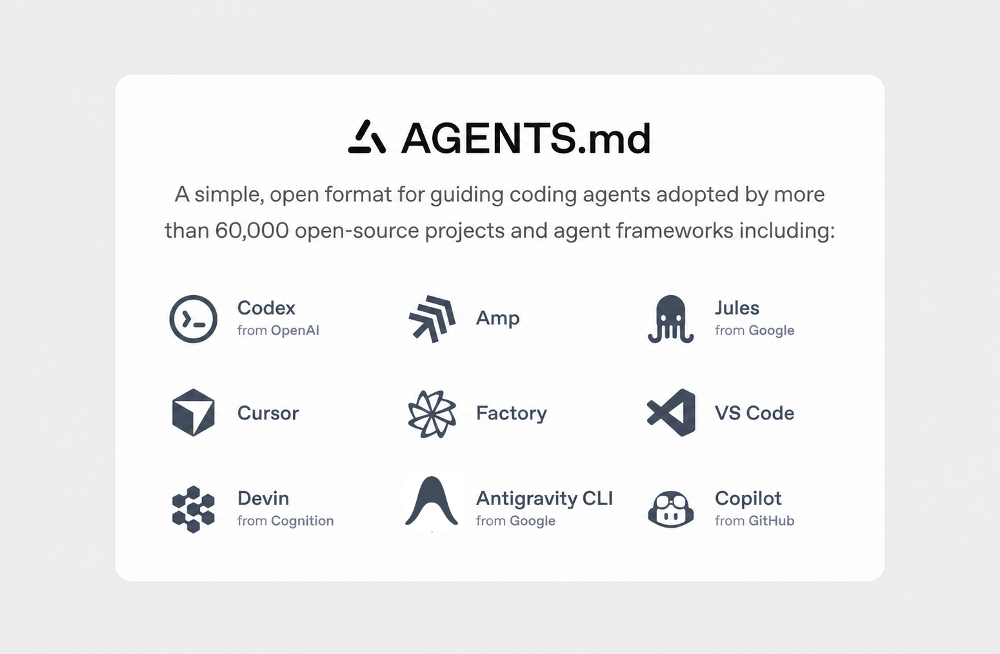

# AGENTS.md



[AGENTS.md](https://agents.md) is a simple, open format for guiding coding agents.

Think of AGENTS.md as a README for agents: a dedicated, predictable place
to provide context and instructions to help AI coding agents work on your project.

Below is a minimal example of an AGENTS.md file:

```markdown
# Sample AGENTS.md file

## Dev environment tips
- Use `pnpm dlx turbo run where <project_name>` to jump to a package instead of scanning with `ls`.
- Run `pnpm install --filter <project_name>` to add the package to your workspace so Vite, ESLint, and TypeScript can see it.
- Use `pnpm create vite@latest <project_name> -- --template react-ts` to spin up a new React + Vite package with TypeScript checks ready.
- Check the name field inside each package/package.json to confirm the right name—skip the top-level one.

## Testing instructions
- Find the CI plan in the .github/workflows folder.
- Run `pnpm turbo run test --filter <project_name>` to run every check defined for that package.
- From the package root you can just call `pnpm test`. The commit should pass all tests before you merge.
- To focus on one step, add the Vitest pattern: `pnpm vitest run -t "<test name>"`.
- Fix any test or type errors until the whole suite is green.
- After moving files or changing imports, run `pnpm lint --filter <project_name>` to be sure ESLint and TypeScript rules still pass.
- Add or update tests for the code you change, even if nobody asked.

## PR instructions
- Title format: [<project_name>] <Title>
- Always run `pnpm lint` and `pnpm test` before committing.
```

## File placement

Place `AGENTS.md` at the root of your repository. Agents look for this file first when starting work in your codebase.

For **monorepos**, you can place additional `AGENTS.md` files inside individual packages or directories. Agents that support nested discovery merge instructions based on proximity — package-level files take precedence over the root file for work happening in that subtree:

```
my-monorepo/
├── AGENTS.md          # Root-level instructions (applies everywhere)
├── packages/
│   ├── api/
│   │   └── AGENTS.md  # API-specific instructions (supplements or overrides root)
│   └── web/
│       └── AGENTS.md  # Web-specific instructions (supplements or overrides root)
```

## Per-agent targeting

When running multiple agents in the same codebase, you may want to give different instructions to each one. The `AGENTS.[agent].md` naming convention lets you do this without fragmented config files:

```
AGENTS.md           # Shared baseline — read by all agents
AGENTS.cursor.md    # Cursor-specific additions
AGENTS.codex.md     # Codex-specific additions
AGENTS.copilot.md   # GitHub Copilot-specific additions
```

Agents that support this convention read both `AGENTS.md` and their named override file, appending the per-agent instructions after the shared baseline. This keeps common context in one place while allowing per-tool customisation.

> **Agent authors:** to opt in, look for `AGENTS.<your-tool-name-lowercase>.md` alongside `AGENTS.md` and append its contents to the shared context you load.

## Website

This repository also includes a basic Next.js website hosted at https://agents.md/
that explains the project's goals in a simple way, and featuring some examples.

### Running the app locally
1. Install dependencies:
   ```bash
   pnpm install
   ```
2. Start the development server:
   ```bash
   pnpm run dev
   ```
3. Open your browser and go to http://localhost:3000
